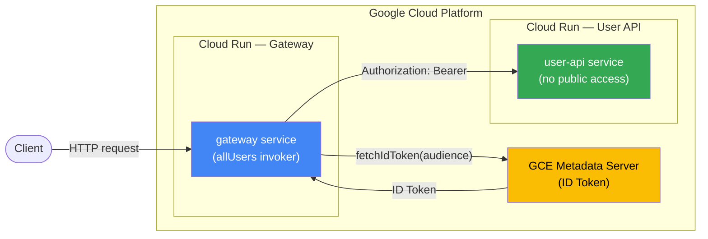

# Cloud Run Service-to-Service Authentication

## Architecture



### IAM Policy

| Service | Member | Role |
|---|---|---|
| gateway | `allUsers` | `roles/run.invoker` |
| user-api | `gateway-sa@...` | `roles/run.invoker` |

---

## ปัญหา

Gateway ยิง request ไปหา Cloud Run service แล้วได้ 401 Unauthorized เพราะ Cloud Run service ที่ไม่ได้ตั้ง `--allow-unauthenticated` ต้องการ valid Google ID token ทุก request

## สาเหตุทั้งหมดที่พบ

1. Gateway ไม่ได้แนบ ID token ไปกับ request
2. Gateway service เองก็ไม่ได้ตั้ง `allUsers` invoker (client เข้าไม่ได้เลย)
3. Forward `host` header ไปด้วยทำให้ Cloud Run reject
4. Forward headers ทั้งหมดทำให้ได้ 431 Request Header Fields Too Large

---

## วิธีแก้

### 1. ติดตั้ง google-auth-library

```bash
bun add google-auth-library
```

### 2. แก้ gateway code

```ts
import { GoogleAuth } from "google-auth-library";

const auth = new GoogleAuth();

async function getIdToken(audience: string): Promise<string | null> {
  try {
    const client = await auth.getIdTokenClient(audience);
    return await client.idTokenProvider.fetchIdToken(audience);
  } catch {
    return null;
  }
}
```

- สร้าง `GoogleAuth` instance เดียว reuse ทุก request (token cache อัตโนมัติ)
- ใช้ upstream base URL เป็น `audience`

ใน request handler:

```ts
const headers = new Headers();
const allowedHeaders = ["content-type", "accept", "accept-language", "accept-encoding"];
for (const key of allowedHeaders) {
  const value = request.headers.get(key);
  if (value) headers.set(key, value);
}

const idToken = await getIdToken(upstream);
if (idToken) {
  headers.set("Authorization", `Bearer ${idToken}`);
}
```

- forward เฉพาะ header ที่จำเป็น (ป้องกัน 431)
- ไม่ forward `host` header (ป้องกัน Cloud Run reject)
- inject `Authorization: Bearer <id-token>` ทุก upstream request

### 3. ตั้ง IAM บน upstream service

ให้ gateway service account มีสิทธิ์ invoke upstream service:

```bash
# หา SA ของ gateway
gcloud run services describe <GATEWAY_SERVICE_NAME> \
  --region <REGION> \
  --format="value(spec.template.spec.serviceAccountName)"

# เพิ่ม invoker permission
gcloud run services add-iam-policy-binding <UPSTREAM_SERVICE_NAME> \
  --region <REGION> \
  --member="serviceAccount:<GATEWAY_SA_EMAIL>" \
  --role="roles/run.invoker"
```

### 4. ตั้ง IAM บน gateway service (public)

Gateway ต้องรับ request จาก client ได้:

```bash
gcloud run services add-iam-policy-binding <GATEWAY_SERVICE_NAME> \
  --region <REGION> \
  --member="allUsers" \
  --role="roles/run.invoker"
```

---

## หมายเหตุ

- `google-auth-library` ทำงานได้ทันทีบน Cloud Run โดยไม่ต้องตั้ง env var เพราะดึง credentials จาก metadata server อัตโนมัติ
- Local dev ต้องตั้ง `GOOGLE_APPLICATION_CREDENTIALS=/path/to/service-account-key.json`
- IAM binding ใช้เวลา propagate ประมาณ 1-5 นาที
- Default compute SA รูปแบบ: `<PROJECT_NUMBER>-compute@developer.gserviceaccount.com`

---

## วิธีเช็ก IAM policy

```bash
# เช็ก upstream service
gcloud run services get-iam-policy <SERVICE_NAME> --region <REGION>

# ถ้าได้ etag: ACAB = ไม่มี binding เลย = require auth
# ถ้ามี allUsers = public
```
