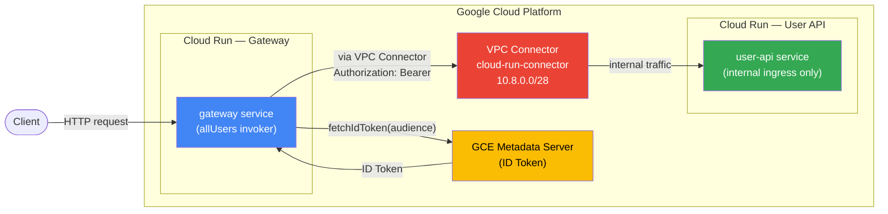

# Cloud Run Internal Ingress with VPC Connector

## Architecture



### IAM Policy

| Service | Member | Role |
|---|---|---|
| gateway | `allUsers` | `roles/run.invoker` |
| user-api | `gateway-sa@...` | `roles/run.invoker` |

---

## ขั้นตอน

### 1. สร้าง VPC Connector

```bash
gcloud compute networks vpc-access connectors create cloud-run-connector \
  --region europe-west1 \
  --range 10.8.0.0/28 \
  --min-instances 2 \
  --max-instances 3 \
  --machine-type e2-micro
```

### 2. Attach VPC Connector ให้ gateway

```bash
gcloud run services update <GATEWAY_SERVICE_NAME> \
  --region europe-west1 \
  --vpc-connector cloud-run-connector \
  --vpc-egress all-traffic
```

### 3. ตั้ง user-api เป็น internal ingress

```bash
gcloud run services update gcloud-run-starter-user-api \
  --region europe-west1 \
  --ingress internal
```

> code ไม่ต้องแก้ — URL เดิมใช้ได้เลย

---

## Cost

| รายการ | ราคา |
|---|---|
| VPC Connector (e2-micro × 2 instances) | ~$14/เดือน |
| Egress traffic ผ่าน connector | $0.01/GB |

รวมประมาณ **$14-20/เดือน** — ไม่มี free tier

---

## เปรียบเทียบกับ IAM + `--ingress all`

| | IAM + ingress all | VPC Connector + internal ingress |
|---|---|---|
| Security | IAM-based | IAM + network isolation |
| Cost | ฟรี | ~$14/เดือน |
| Setup | ง่าย | ซับซ้อนกว่า |
| Compliance | ส่วนใหญ่เพียงพอ | เหมาะกับ strict network policy |
